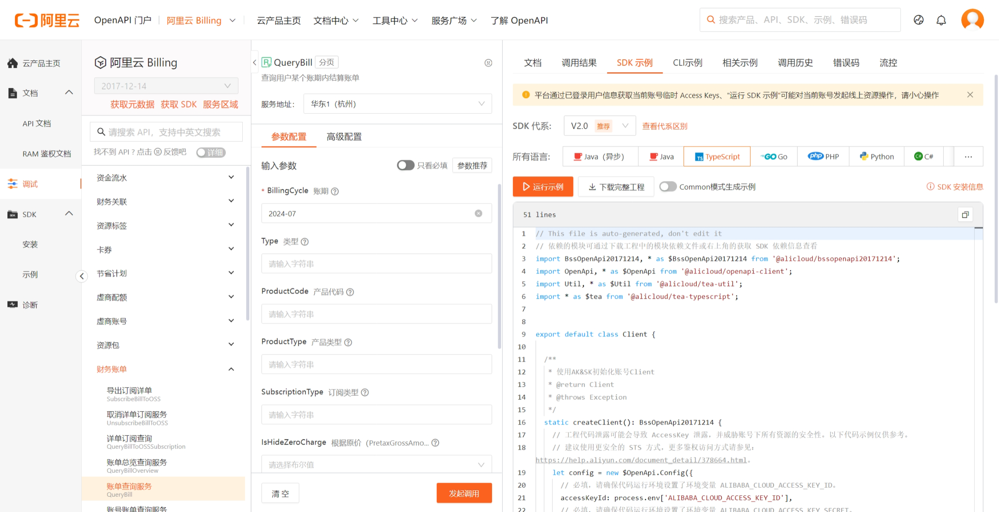
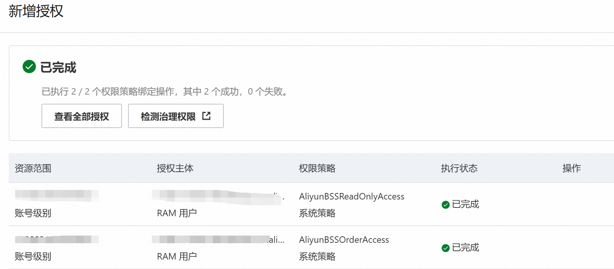
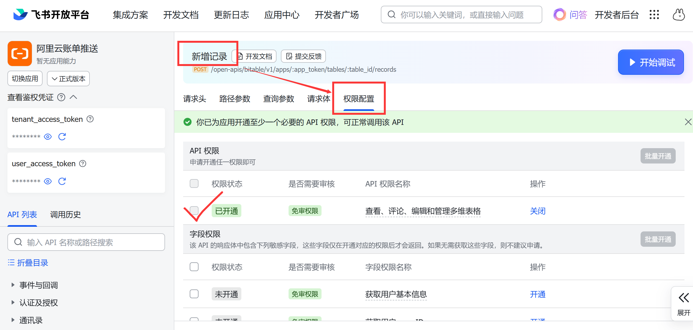
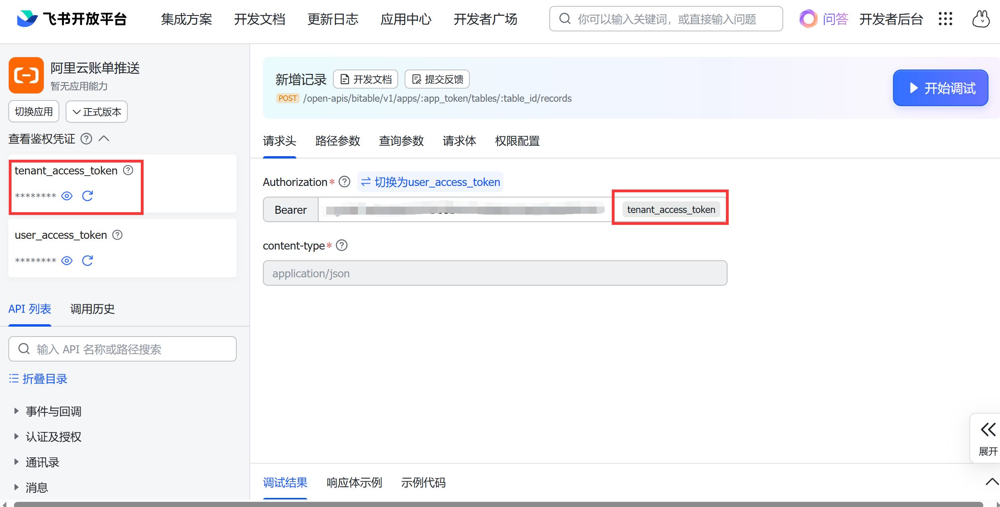
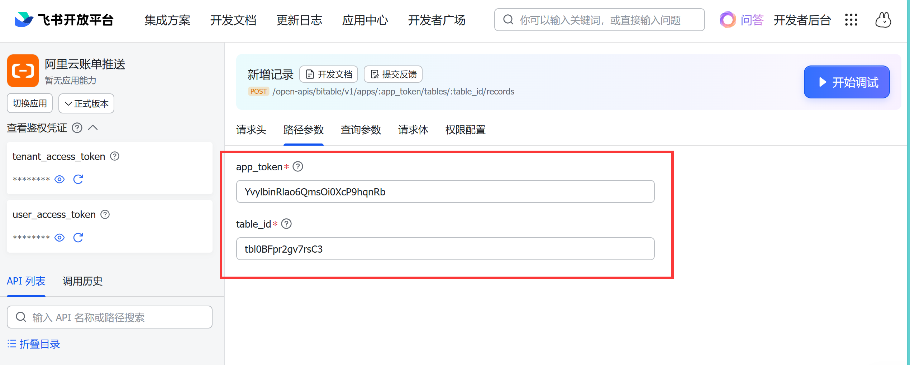
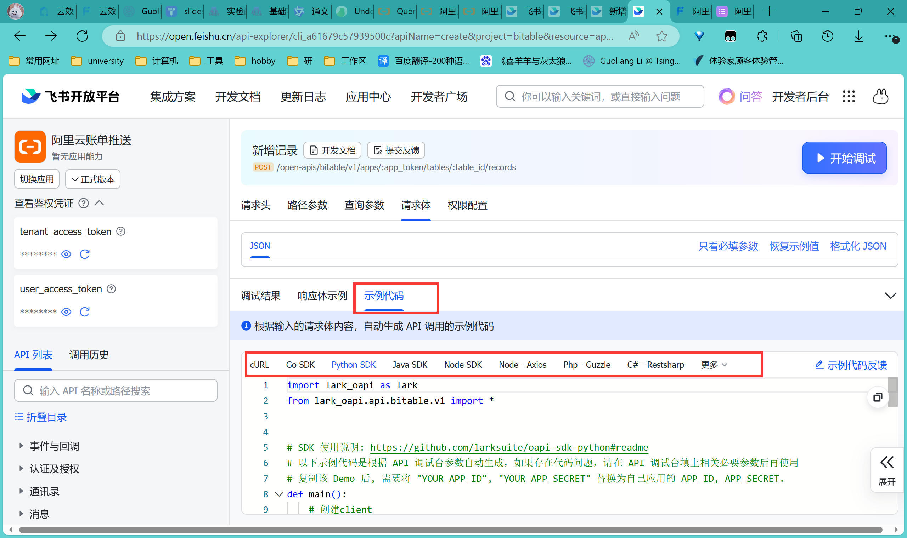
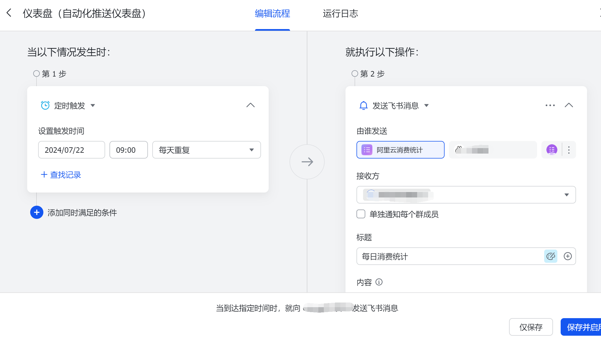
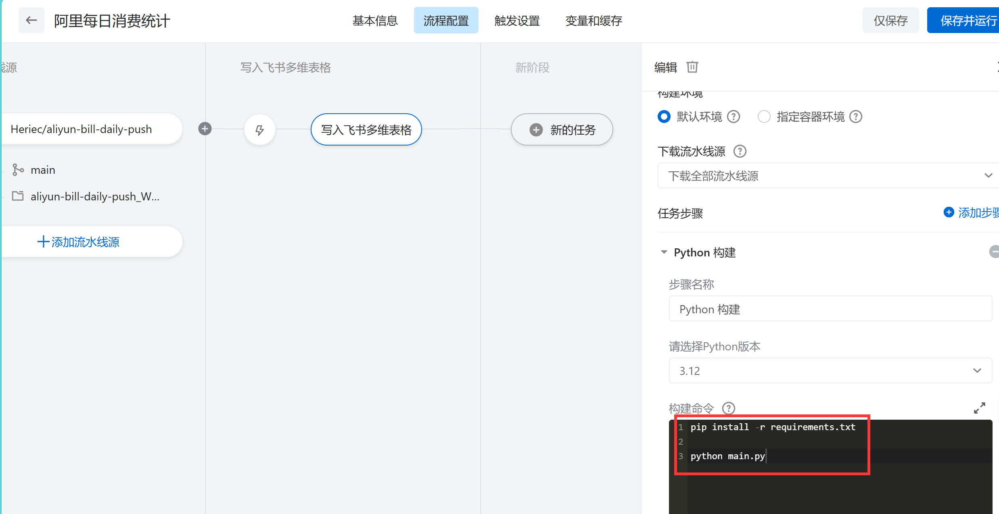

# 前言

在自己开发网站时候，使用了CDN服务，众做周知，CDN会导致经常被刷这种情况，所以我想每日看到账单消费，所以我先去阿里云上找，但是找半天都没找到，这就很麻烦了，我只能自己开发。

设想的就是所有流程都是自动化过程，不需要搭建服务器，所以这才有了这篇博客。

# 阿里云open api

## 授权

我们想要获取到阿里云的账单就要借助于他的open api接口

https://api.aliyun.com/api/BssOpenApi/2017-12-14/QueryBill?tab=DEMO



我使用的是这个接口，因为他能获取到每日每小时的CDN花费，这样我们在飞书中就可以用飞书的表格直接绘制了

这里我用ts代码导包有点问题后我就懒得继续了，换成python了

还需要access keys，我在阿里云控制台创建一个子用户，需要赋予权限，我就给了两个，有需求后续再加



如果你不知道对应的权限是什么，可以自行查阅[RAM 访问控制 (aliyun.com)](https://ram.console.aliyun.com/policies)

然后生成对应的access key

```
ALIBABA_CLOUD_ACCESS_KEY_ID=xxxx
ALIBABA_CLOUD_ACCESS_KEY_SECRET=xxxx
```

然后就执行一下代码，确实能拿到数据了

```python
import os

from typing import List

from alibabacloud_bssopenapi20171214.client import Client as BssOpenApi20171214Client
from alibabacloud_tea_openapi import models as open_api_models
from alibabacloud_bssopenapi20171214 import models as bss_open_api_20171214_models
from alibabacloud_tea_util import models as util_models
from alibabacloud_tea_util.client import Client as UtilClient


class AliyunClient:
    def __init__(self):
        pass

    def create_client(self) -> BssOpenApi20171214Client:
        """
        使用AK&SK初始化账号Client
        @return: Client
        @throws Exception
        """
        config = open_api_models.Config(
            access_key_id=os.environ['ALIBABA_CLOUD_ACCESS_KEY_ID'],
            access_key_secret=os.environ['ALIBABA_CLOUD_ACCESS_KEY_SECRET']
        )
        config.endpoint = f'business.aliyuncs.com'
        return BssOpenApi20171214Client(config)

    def billList(self) -> None:
        client = self.create_client()
        query_bill_request = bss_open_api_20171214_models.QueryBillRequest(
            billing_cycle='2024-07',
            page_size=100
        )
        runtime = util_models.RuntimeOptions()
        try:
            response = client.query_bill_with_options(
                query_bill_request, runtime)
            body = UtilClient.to_map(response.body)
            return body['Data']['Items']['Item']
        except Exception as error:
            print(error.message)
            print(error.data.get("Recommend"))
            UtilClient.assert_as_string(error.message)
```

## 数据分析

对于访问的接口，我们要知道对应的数据是什么

```json
{
 "AdjustAmount": 0.0, 信用额度退款抵扣
 "CashAmount": 0.0, 现金支付
 "CommodityCode": "cdn", 商品 Code
 "DeductedByCashCoupons": 0.0, 代金券抵扣
 "DeductedByCoupons": 0.0, 优惠券抵扣
 "DeductedByPrepaidCard": 0.0, 储值卡抵扣
 "InvoiceDiscount": 0.0, 优惠金额
 "OutstandingAmount": 0.0, 未结清金额
 "OwnerID": "1730831850540820",
 "PaymentAmount": 0.0, 现金支付
 "PaymentTime": "",
 "PipCode": "cdn", 产品 Code
 "PretaxAmount": 0.0, 应付金额
 "PretaxGrossAmount": 0.0, 原始金额。
 "ProductCode": "cdn", 产品代码。
 "ProductDetail": "CDN", 产品明细
 "ProductName": "CDN", 产品名称。
 "ProductType": "CDN", 产品类型
 "RecordID": "2024071593469103",
 "RoundDownDiscount": 0.0,  抹零优惠
 "UsageEndTime": "2024-07-20 23:00:00",
 "UsageStartTime": "2024-07-20 22:00:00"
},
```

抽取几个我自己想要的，然后载飞书多维表格中创建


然后就是飞书的操作了

# 飞书操作多维表格

我们要把阿里云的数据插入飞书的多维表格要借助于飞书的应用

先去飞书开放平台创建应用https://open.feishu.cn/

然后直接去文档中看https://open.feishu.cn/document/server-docs/docs/bitable-v1/app-table-record/create

以新增多维表格为例：

- 请求头需要Authorization，一般都是获取到的token

- 路径参数

  - app_token：多维表格的标识，也就是表格的唯一id
  - table_id：每个表格的其中一个数据表的唯一标识

  这两个参数帮我们找到对应操作的表

- 请求体：fields作为传递的参数传进去

很简单是吧，直接去API控制台调试去

我们操作的第一步是开通权限，就不用去应用里面搜索了



然后切换到请求头里，使用tenant_access_token，不用user_access_token的原因是代码里获取比较繁琐，不如用tenant_access_token



user_access_token就是用户权限，可以操作用户自己有权限的多维表格

tenant_access_token就是应用的权限，但是我们现在应用没有权限，所以需要我们对应表格的给予权限，在文档右上角三个点->更多->添加文档应用


然后搜索应用名字添加就有权限了

之后切换到控制台的路径参数



这个参数我们哪里找，就是多维文档的链接上找

比如：https://dwrcg3plo7z.feishu.cn/base/YvylbinRlao6QmsOi0XcP9hqnRb?table=tbl0BFpr2gv7rsC3&view=vewdBCkzgu

这里还有view就是哪个视图，在删除时候会用的到

最后请求体

```json
{
  "fields": {
    "产品名称": "xxx",
    "计费开始时间": 1721627295872,
    "原始金额": 100,
    "代金券抵扣": 3,
    "优惠金额": 3,
    "抹零优惠": 0.25,
    "应付金额": 3.333
  }
}
```

这些字段就是你表格的列，值自己定义

**这里需要注意一点，多维表格里的日期值指定为日期后，我们json传时间戳，而不是字符串日期**

然后我们就可以进行测试了，我们直接是线上版本测试，个人应用无所谓，成功后我们直接看示例代码，自己选择语言



我这里就选择python，然后就可以开始开个仓库写代码了

其实主要流程就是

1. 阿里云客户端操作获取账单数据
2. 将账单数据传给飞书客户端进行操作多维表格

提供一下我自己仓库代码：[Heriec/aliyun-bill-daily-push (github.com)](https://github.com/Heriec/aliyun-bill-daily-push)，比较简单，核心就3个py文件

-----

完成上述操作后，我们想要定时将多维表格发送给我们，我一直想通过飞书机器人中的webhook回调后呈现出来，后来发现不行，自定义应用使用机器人功能后，对应的webhook得自己服务器提供，那这样就不行了

结果后来发现多维表格可以自己定时推送，就在表格上方的自动化按钮中，如果是仪表盘页面还可以直接预览仪表盘，我们就创建个好看的仪表盘，然后定时推送即可



写到这里你肯定要有疑问，你现在可以定时推送表格，但是表格内容都是自己手动执行的呀，不是自动执行的。

是的，我们还没说如何自动执行更新，其实自动的方式很容易想到github action实现，大致步骤就是获取python环境后执行代码，本质上我是想实现执行完进行回调的，但是不好实现，**所以就让执行定时任务的时间在多维表格之前来实现了**，其实也没什么影响，不过不够优雅

对了，使用仓库执行需要配置环境变量，不然无论是自己手动执行还是github action都无法执行

```bash
# 阿里云所需变量
ALIBABA_CLOUD_ACCESS_KEY_ID=xxx
ALIBABA_CLOUD_ACCESS_KEY_SECRET=xxx
# 飞书应用所需变量
FEISHU_APP_ID=xxx
FEISHU_APP_SECRET=xxx
# 多维表格所需变量
APP_TOKEN=xxx
TABLE_ID=xxx
VIEW_ID=xxx
```

另一种方式就是使用阿里云的**云效**平台，也算是给阿里云打广告了，里面有流水线功能


里面的写入飞书多维文档的流程：



我做几点说明：

- 我使用`pip install -r requirements.txt`安装的依赖，对应的 requirements.txt 是通过`pip freeze > requirements.txt`生成的，每次我都记不住，这里mark一下

- 生成的依赖太多了，所以我精简了一下

  ```
  alibabacloud-bssopenapi20171214==4.0.1
  lark-oapi==1.2.10
  ```

  其实跟直接pip安装没区别，这里依赖少没太大区别，依赖多了就知道requirements.txt的重要性了

- 采用阿里云的python版本环境3.9依赖，openssl版本都很低，会跟urllib3不兼容，所以我直接用了3.12就没这个问题了，我自己电脑3.8是没有这个问题的，不知道哪里的问题

- 最后安装完依赖就执行`python main.py`即可

- 云效可以配置**任务插件**，也就是飞书等平台的通知，这里其实是可以实现回调给飞书的

  

  虽然是限免，但是也可以用，我没用的主要原因是他只能发送数据表，不发送仪表盘，这样就不能预览了，我展示一下两者的区别：

  

  是不是两者的区别很大，我仪表盘的预览效果真的好，想点进去就再点进去就可以了，其实我想用仪表盘显示多折线图的，但是好像可选的样式不是很多，不好实现我想要预览每个时间点的折现，我就没有继续操作了，可惜，所以最后还是用流水线在推送表格时间之前来解决这一矛盾

Ps：记得配置环境变量


--------

# 后续

我的cdn消耗只能看到每日消费，但是我买了流量包，所以基本这里没有什么消费的钱，所以我还需要cdn的每日统计

具体内容我写在[飞书发送每日阿里云CDN账单到飞书卡片](https://h-blog.zeabur.app/2024/11/10/飞书发送每日阿里云CDN账单到飞书卡片/)

并添加了新变量`FEISHU_WEBHOOK`
